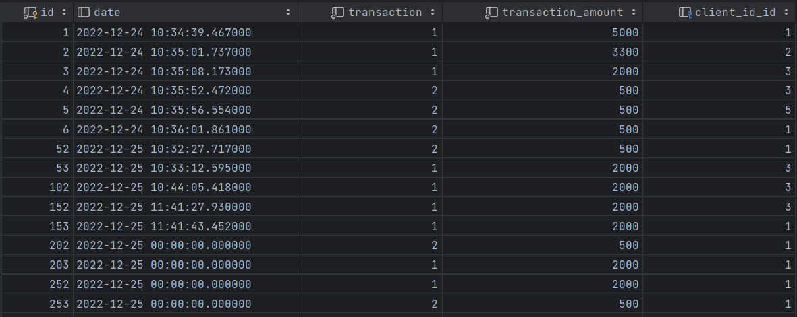

# Выпускной проект на платформе SkillFactory. Курс "Профессия Java-разработчик".

## Общая информация:
Проект представляет из себя API для Интернет-банка.
В проекте реализовано Rest API для получения из базы-данных информации о состоянии
счета клиента, пополнения счета клиента и списания с средств со счета клиента.

## Используемые технологии:
* Spring Boot v.3.0.0
* Spring Web v.3.0.0
* Spring Data v.3.0.0
* Lombok 
* Postgres DB v.14

## Реализованные функции:
В текущей версии реализованы 5 комнд в API:
1. getMoney(Long id) - получение информации о балансе клиента банка из БД по id клиента.
2. takeMoney(Long id, double money) - списание средств со счета клиента по id клиента, при условии, что баланс счета больше или равен сумме списания.
3. putMoney(Long id, double money) - зачисление средств на счет клиента по id клиента.
4. getOperationList(Long id, String dateOfStart, String dateOfEnd) - получение информации о транзакциях клиента за выбранный интервал, если временной интервал не указан, то выдаются транзакции пользователя за все время.
5. getAllClients() - получение информации из БД о состоянии счетов всех клиентов.

## Структура БД:

Таблица clients_info (информация о балансе счета клиента):
* id - первичный ключ, id клиента
* balance - колчиество денег не счету клиента

Таблица clients_transactions (информация об операциях с балансом счета клиента):
* id - первичный ключ, id транзакции
* date - дата транзакции
* transaction - тип транзакции (1 - пополнение счета, 2 - выдача денег)
* transaction_amount - сумма транзакции
* client_id_id - внешний ключ, id клиента из таблицы clients_info

